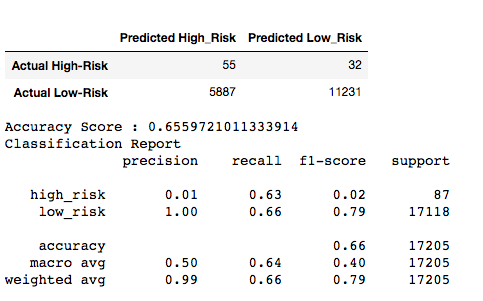
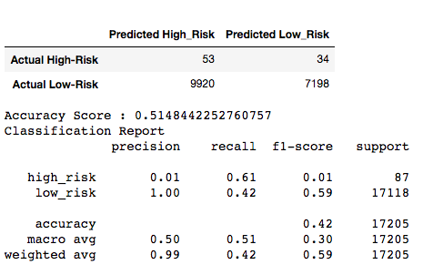

# Credit_Risk_Analysis

DELIVERABLE RESULTS:
Below are the results from the various techniques used to predictive model for High-Risk loans.

SMOTEENN:

SMOTE:

RandomOverSample:

ClusterCentroids:

EasyEnsembleClassifier:

BalancedRandomForestClassifier:

#Summary

For all models, using EasyEnsembleClassifier is the most efficient. Offers a higher score on all subprime loans. Accuracy is low or zero on all models. In general, using EasyEnsembleClassifier for more than 90% of current reviews will result in high credit accuracy as a great value for general reviews.

